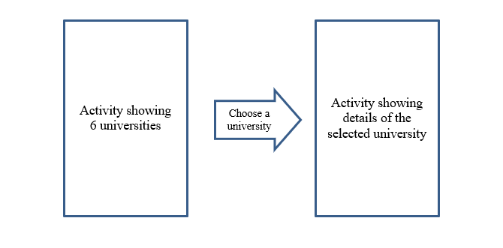
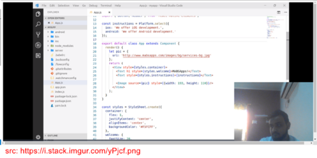

# Practical Quiz for Learning Package 4

This document outlines the information of the Practical Quiz.

This repository contains the skeleton code for the quiz.

### Content of the quiz

1. Create an app that let users knows more about the public funded universities in Singapore.
2. The app should meet the following requirements:
- The app will contain multiple Activities
- CollectionActivity
  - The name of the universities should be listed on the first Activity
  - User is able to select one university from the 6 choices and the details of the selected university in the to be shown in the DetailsActivity
- DetailsActivity
  -	Shows short description of the selected university, its world ranking (if any) and any other brief information
  -	Right clicking on the description bring out a menu that let user increase or decrease the font size of the description text
- The user interface and experience in using your app would be part of the assessment

3. Shown below is a sketch of the outline of the app:

#### The tasks to be completed

The skeletal structure of the app has been given in the repository. You need to study what were given and to complete the rest.

1. Write the necessary code / configurations to fulfil the requirement described above
2. Perform a video recording and submit the video to MS Stream, with the following rules:
- You are allowed to develop the app using one(1) monitor/display
- You may re-attempt the screen recording before choosing to submit the best attempt
- You are allowed to have multiply tries and submit only the best attempt
- Criteria for the video:
  - The whole desktop shall be recorded
  - The recording must be recorded straight through (i.e. you are not allowed to pause and resume)
  - The duration of the produced video shouldn't be more than 30 mins (the part after the first 30 mins will not be taken into consideration)
  - You are required to narrate/verbalise your action during the app development and will be assessed. The intention is to let the viewer to understand how you go about solving this from the start to the end.
  - Your webcam should be turned on and inserted as the talking head in the video, like the example shown below:

 

### Deliverables to be submitted

You are to clone from the designated repository given to you (in which, this is the one).

You are required to commit and push your code into your repository regularly and GitHub will do the necessary code tracking.
Hub will do the necessary code tracking.

| Parts                       | Deadline                                                             |
|:----------------------------|:---------------------------------------------------------------------|
| Solution for CA2 Practical  | Pushed into this repository by <u>30 May 2021 2359hr</u>, <b>and</b> 
 Compress the Android project into a .zip file named <your name>.zip and submit via File Submission named ‘Practical 2 Assessment Submission’ in LEO Lesson 6 learning path, latest by <u>30 May 2021 2359hr</u>  |
| Recorded Video              | Video title must follow the format “C346 CA2 – 1901xxxx”, where 1901xxxx to be replaced with your student ID. 
 Access rights (owner) set to jason_lim@rp.edu.sg 
 <**https://web.microsoftstream.com/video/6ac51f33-4187-4238-9044-011d25902b71**>                                       |

### Resources:

You may use Flashback Express or OBS software for the recording.

Simple guide on video uploading to MS Stream https://c346-2021.github.io/codelab/video/index.html

On files adding into GitHub repository, you can refer to a guide here: https://c346-2021.github.io/codelab/github/index.html#5

## Practical Integrity

- Write your name and student ID as comment at the top of the Java file
- Every submission should be each student’s original work
- Plagiarising another person’s or from any other resources like the Internet is considered cheating
- Cheating could result in zero mark for the practical and subject to disciplinary hearing

In essence, what you submit is your own work, without help from others in anyway (unless cited in the submission).

Refer to the link below, if you need more info.  
<http://intranet.rp.edu.sg/sites/StudentHandbook/SitePages/summative_assessment_rules_and_regulations.aspx>

## Academic Integrity

#### Writing Code

Writing code is similar to academic writing in that <b>when you use or adapt code developed by someone else as part of your project, you must cite your source.</b> However, instead of quoting or paraphrasing a source, you include an inline comment in the code. These comments not only ensure you are giving proper credit, but help with code understanding and debugging.

Src: https://integrity.mit.edu/handbook/writing-code

